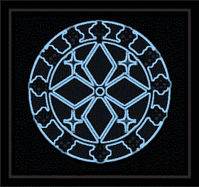

  

  <h1>
「zoltraak project」
</h1>
  
  <h2>
This Debugger for Elixir.
</h2>
  

  <h3>
Dependency is Mason / ElixirLS + <a href="https://github.com/Zeioth/compiler.nvim/wiki/DAP-support-elixir">Default Settings.</a>
</h3>
  <h3>
zoltraak project configuration is near <a href="https://github.com/takkii/cross">cross</a>.
</h3>
  

